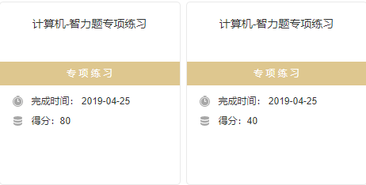

# 2019-04-25任务
## 机器学习基石笔记

### Lecture 8 Noise and Error
&emsp;&emsp;已完成(bingo!)
&emsp;&emsp;https://blog.csdn.net/the_harder_to_love/article/details/89519049

### homework0
&emsp;&emsp;补数学

### homework1
&emsp;&emsp;......

### homework2
&emsp;&emsp;开启

### Lecture 9 Linear Regression
&emsp;&emsp;进行中......(8/24)
&emsp;&emsp;https://github.com/JerryQiang/MachineLearningFoundations/blob/master/lecture9_linear_regression.md

 

**并以博客形式展示学习成果,已初步解决图片资源同步问题。**

## 牛客网

### 智力题10道

